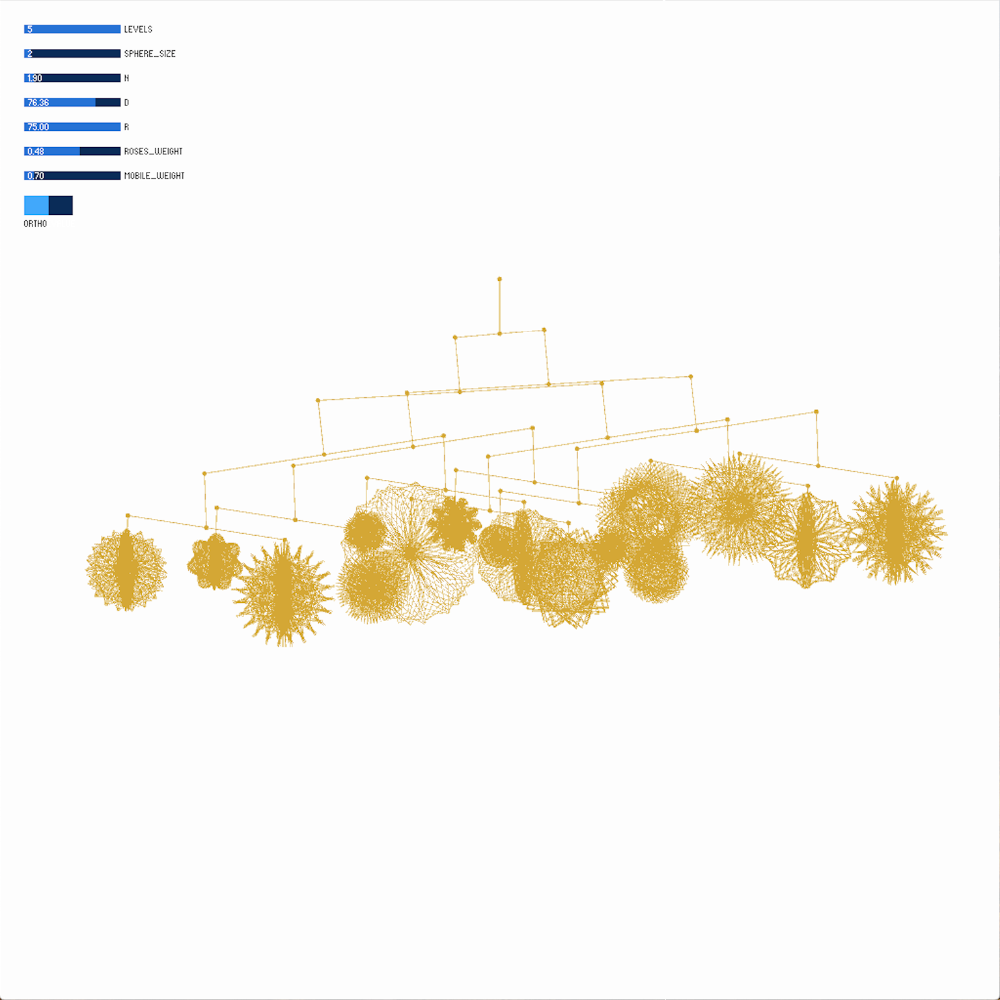

### Week 3: Parametrized Forms -- Garden

For this week's project, I wanted to experiment with impressions of 2D forms in 3D space. These forms could be 3D printed to compose a mobile. I was inspired by Peter M. Maurer's Maurer Rose and Alexander Calder's mobiles that have been described as moving paintings. I wanted to see if I could re-create a plausible mobile. I also wanted to create a parameterization of the roses that could lead to random forms so that the designer would have to explore the possible design space and to increase the likelihood of happening across an unexpected result.

My implementation could be iterated upon to make the mobile physically realizable (adding constraints to avoid self-intersections). Another interesting extension would be to add nontrivial relationships and constraints such as simulating how the rotations would be affected by increasing the weight (via stroke weight or thickness) of the "wire" creating the roses.

