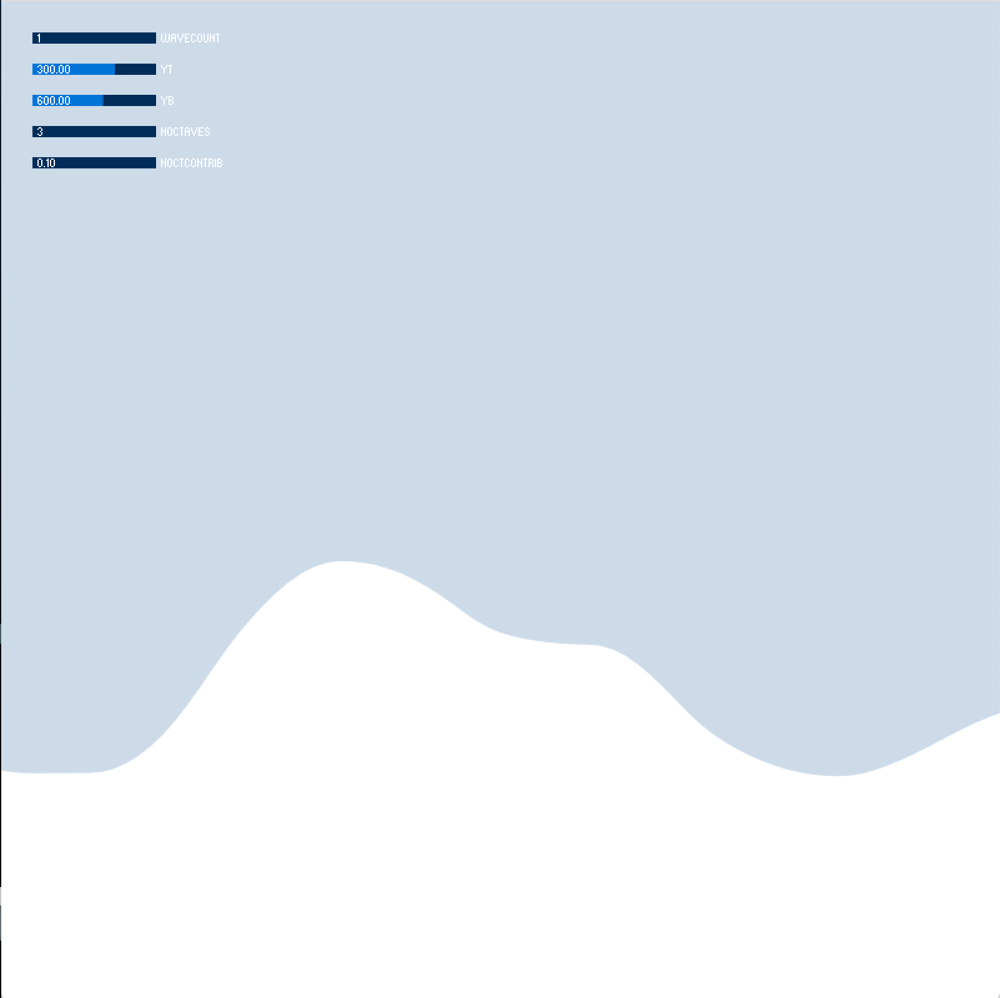
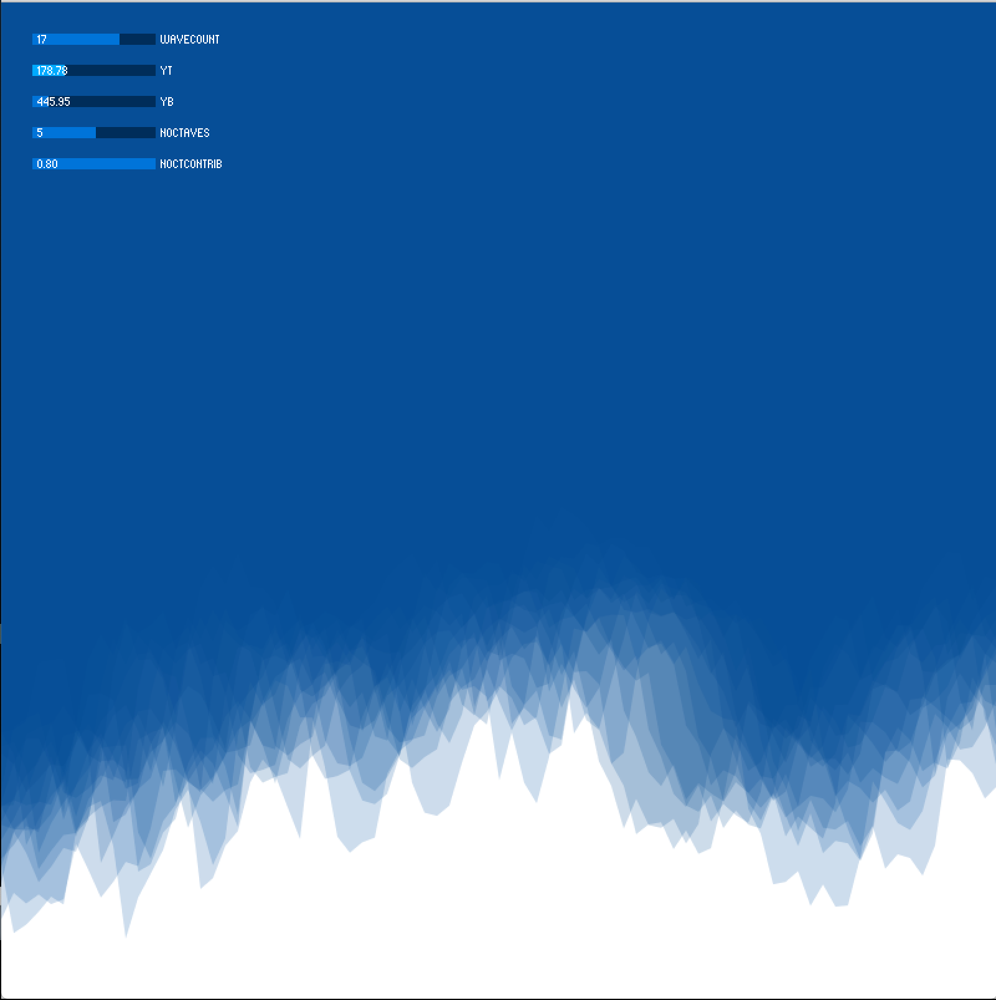

### Week 4: Generative Series - Wavefront

For this week's project, I wanted to simulate a moving wavefront. The wavefront is generated using perlin noise. By using perlin noise, a more natural, smooth form emerges and series of wavefronts can overlap and a consistent structure emerges. The motion is simple and the color is a function of the wavefront's vertical movement. Several controls are exposed including the number of intervals to generate the waveforms, the importance of each subsequent interval (a higher value results in a spiked appearance), the range for the top and bottom of the wavefront, and the number of wavefronts to layer to create a single wave.

