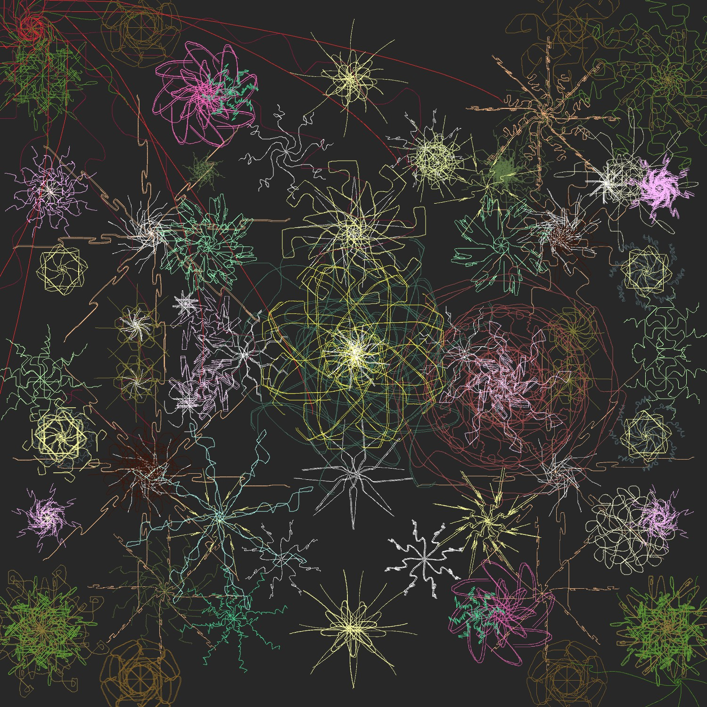
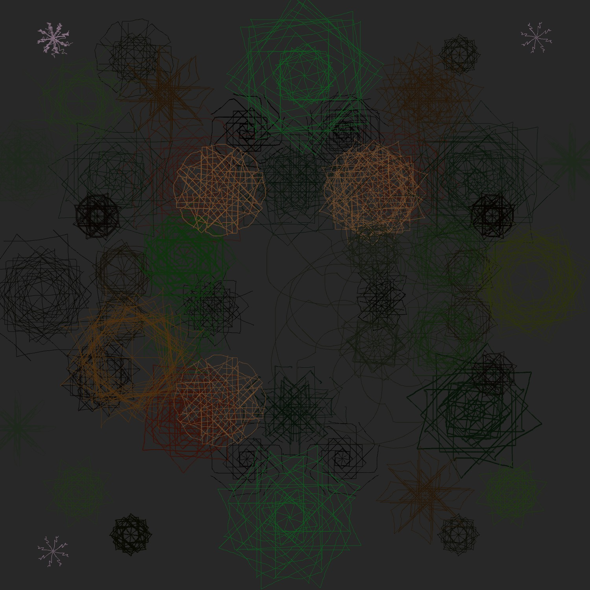
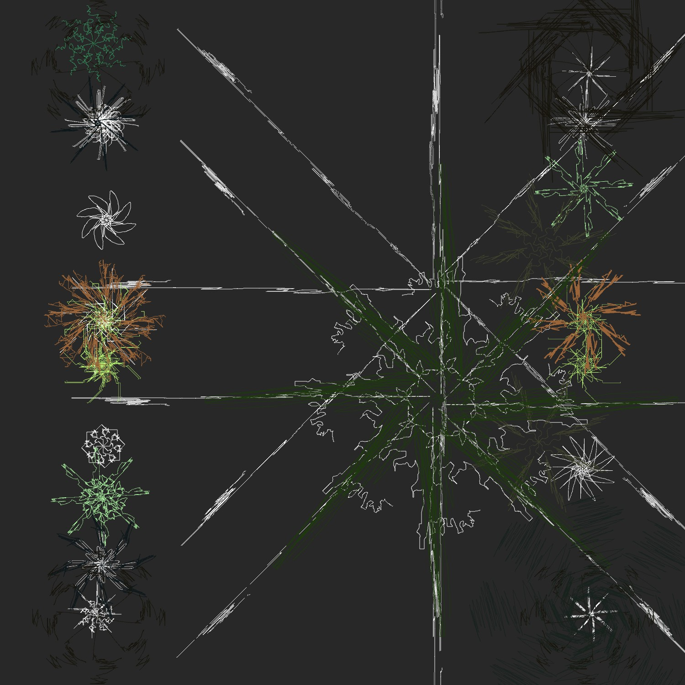

### Week 4: Generative Series - Wavefront

For this week's assignment I was inspired by Sougwen Chen's work using autonomous agents that we discussed during seminar as well as action painting. My idea was to extend some of the simpler drawing brushes like radial brush and mirror brush to create drawing agents that respond to the artist but not precisely. I experimented with using sound as an input. I wanted to see if it would be possible to create output that songs look to me -- loud or stylized in a particular way with a specific color palette. So, the artist and the radial agents respond to sound when making decisions about the composition. At the same time, while that may be an intentional response, I changed the drawing gestures to simply track the movement of the mouse so the tracking is more fluid. I think there's wide range of forms than can be explored with this tool even if it seems limited by radial symmetry. Also ideas emerge like collaboration between artist and program and unexpected complexity from shifted repetitions. I think this tool is different because it brings to the forefront the collaboration between a program and a user in creating a composition where both elements are responding uniquely to an external stimulus and to one another.

