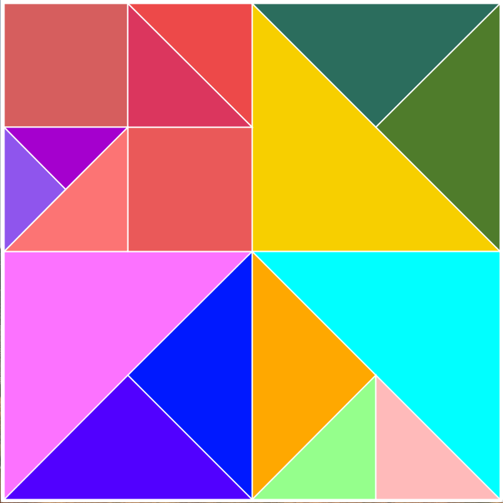
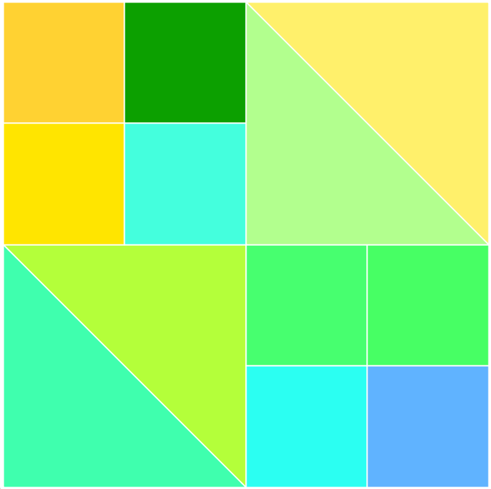
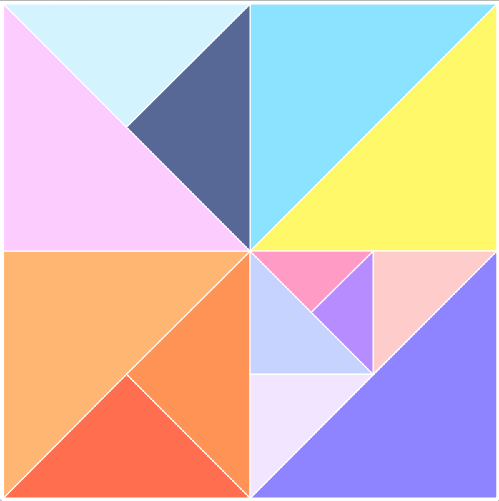
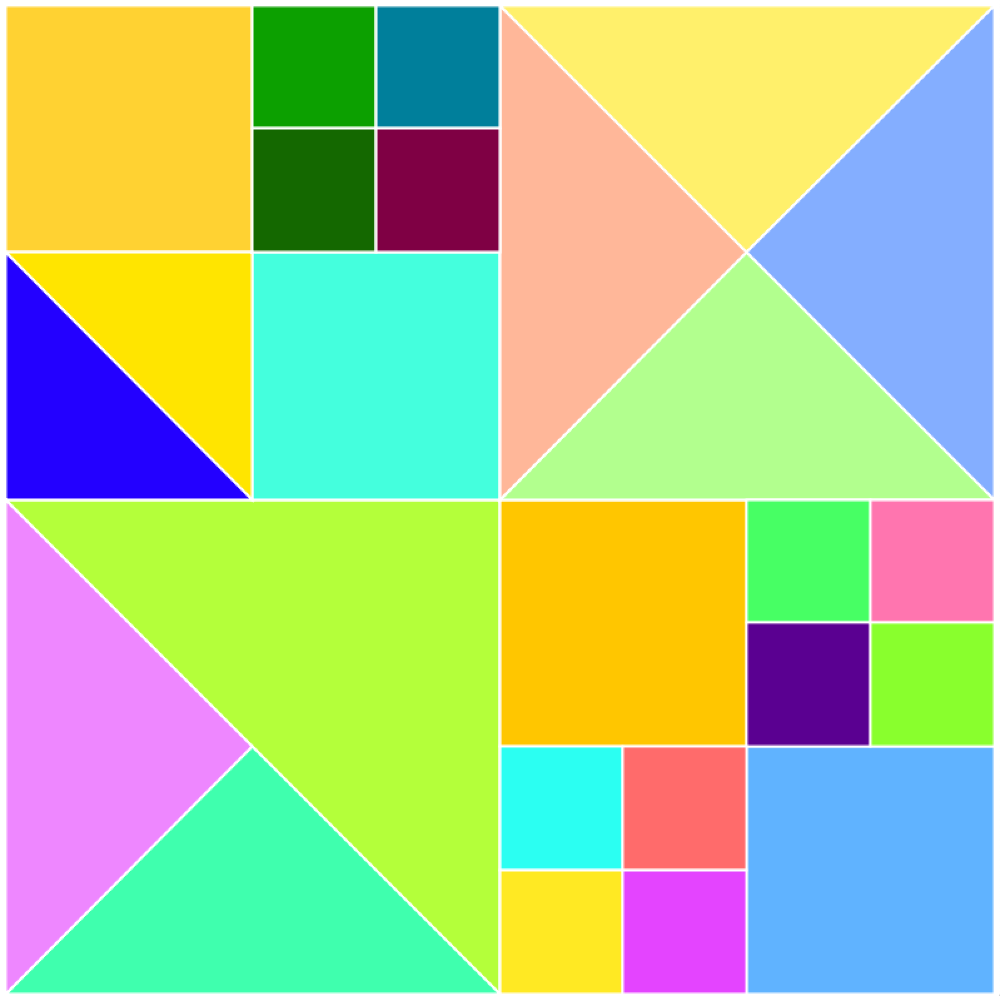

### Week 4: Color Picker -- Simultaneous Colors

I designed my color picker with the process of directed exploration in mind. This tool is for people who want to compose in color -- to see how their juxtapositions lead to different visual effects. They want to explore different possibilities but also rely tool on exact control to fine tune and direct the search space.

The design can be summarized as follows -- an initial swatch appears on screen. The user can manipulate it in HSB or by making it black or white. Any swatch can be split into two or four smaller swatches. One will persist the color of the original swatch while the others step away from the color by drawing from a gaussian distribution and moving further in hue than in saturation or brightness.

I tried to augment ease of control with different gestures. A swatch has to be selected to be activated. Once that is done, the user can drag diagonally upwards to increase brightness or just move their mouse left to right to increase hue or bottom to top to increase saturation. These movements felt the most natural in terms of the response of the color (degree of compatibility). At the same time, I did not want to confine the user to the area defined by the swatch -- so the activation / selection persists until the user clicks again anywhere on screen to deselect the triangle. There are additional supports -- swatches can be set to black by pressing the key 'b' or white using 'w'. The color can be printed out by pressing 'p' and the overall scheme can be saved as an image by pressing 'd'.

I was also inspired by "Simultaneous Windows" by Robert Delaunay.

